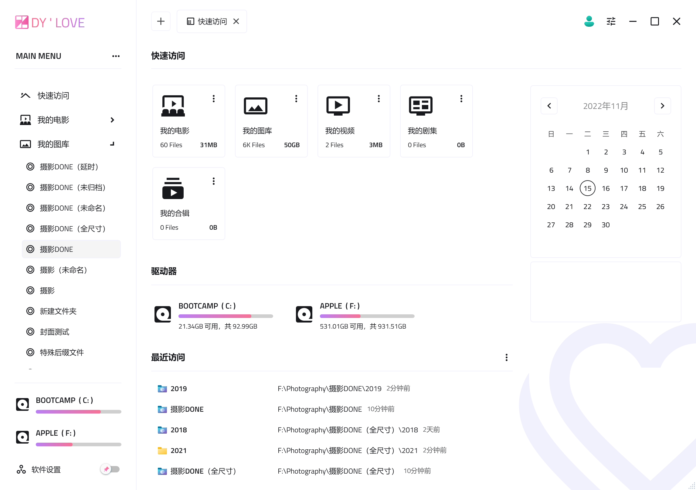

    

<h1 align="center">
    ZHAI 资源管理器
</h1>

ZHAI 资源管理器的想法诞生于我（ZDY）的个人兴趣，我会在我有限的空闲时间里维护这个软件。我承诺绝不在程序中暗藏任何商业广告、木马，但不承诺为使用 ZHAI 的后果承担任何责任。如果您需要将它用于商业目的，或加入您的网站，请与我联系，否则我将保留追究一切责任的权利！

 

## 软件下载

如果你对 [ZHAI](https://github.com/zdy1988/ZHAI.PUBLISH/releases/latest) 感兴趣，不妨试一试...

## 寄语

如果在使用 ZHAI 的过程中发现什么 BUG，欢迎发送描述信息和图片到我的邮箱，也可以在我的 GitHub 上留言，我会尽力改进软件...